# Giới thiệu chung
Dự án này được viết nhằm mục đích tạo MQTT Broker bằng ESP-idf để làm gateway để điều khiển Client MQTT

Dự án này dùng [Mongoose networking library](https://github.com/cesanta/mongoose).      
  
  ---

# Yêu cầu hệ thống

1. Phiên bản ESP-IDF từ 4.4(Thì ESP32-C3 mới dùng đc) trở lên

2. Trong file components của dự án, phải clone Mongoose version 7.7:
```
git clone -b 7.7 https://github.com/cesanta/mongoose.git
```

3. Trong thư mục Mongoose mới, Tạo a CMakeLists.txt file chưa nội dung sau:
```
idf_component_register(SRCS "mongoose.c" PRIV_REQUIRES esp_timer INCLUDE_DIRS ".")
```


---
# Các bước cài đặt
```
cd components/
git clone -b 7.7 https://github.com/cesanta/mongoose.git
cd mongoose/
echo "idf_component_register(SRCS \"mongoose.c\" PRIV_REQUIRES esp_timer INCLUDE_DIRS \".\")" > CMakeLists.txt
cd ../..
idf.py set-target {esp32/esp32s2/esp32s3/esp32c3}
idf.py menuconfig
idf.py flash monitor
```

#  Network Config

---

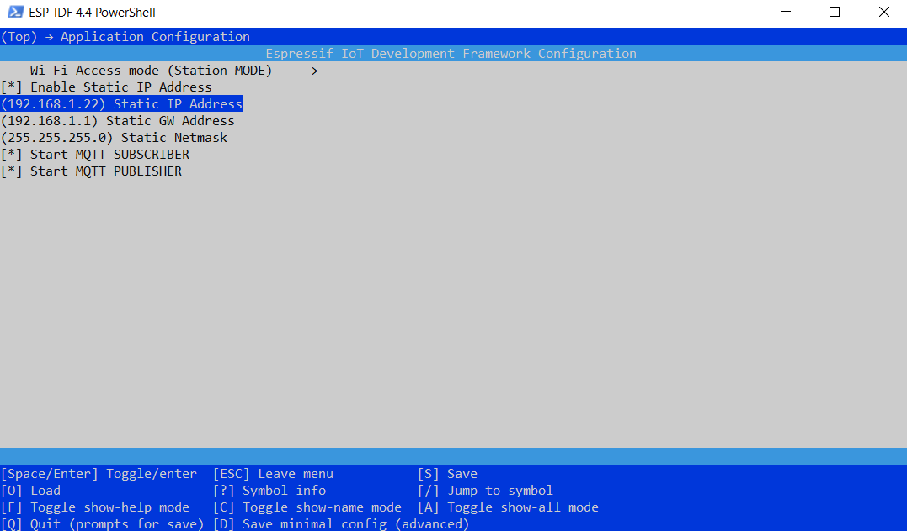

Địa chỉ Static IP Address phải có dạng 0.0.0.0. Chọn MQTT SUBCRIBER VÀ MQTT PUBLISHER nếu muốn Gateway sử dụng cả hai.Địa chỉ ___Host___ của Broker sẽ dựa theo IP của ESP-32. Ví dụ trong hình bên trên sẽ là [mqtt://192.168.1.22:8000](mqtt://192.168.1.22:8000)

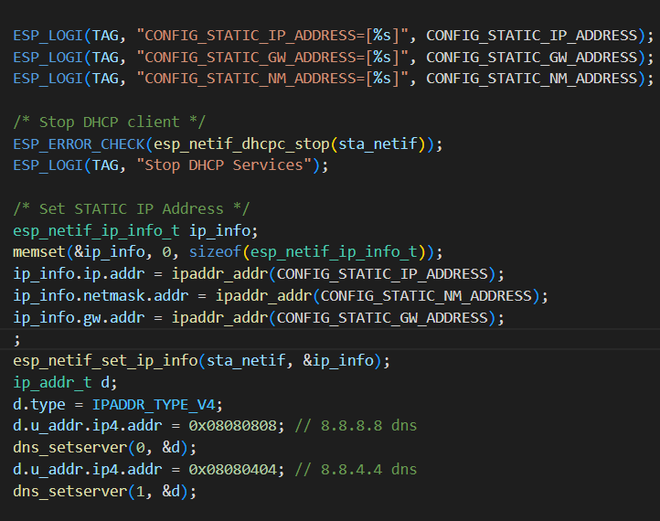

---

## I2C Config
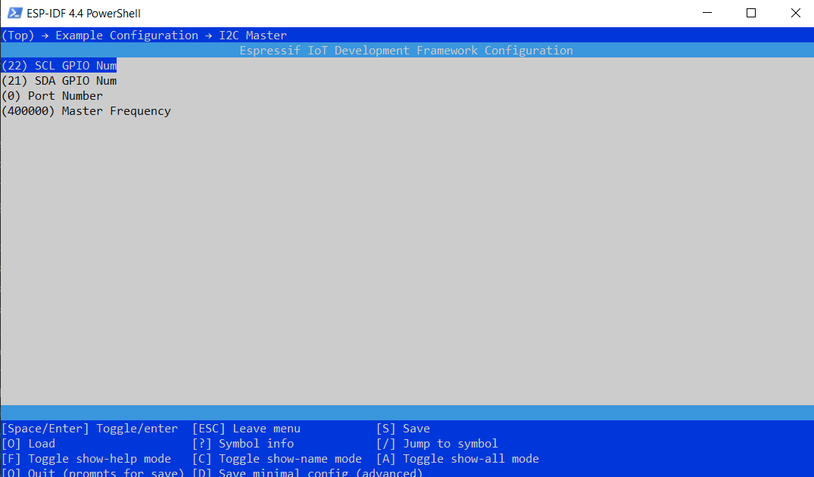

 Tuỳ chọn chân và tần số cho I2C

 ---

## Partitions Config
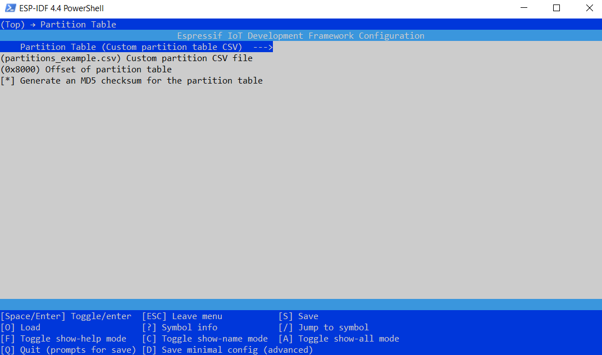

---

# Giao diện Web
#### Cài đặt wifi ban đầu

Khi chưa khởi tạo lần đầu cho ESP-32 thì nó sẽ chạy ở chế độ Access Point và Thiết bị đầu tiên kết nối sẽ có địa chỉ IP:192.168.4.2.Sau đó gửi request đến AP bằng cách truy cập [192.168.4.1/hello](192.168.4.1/hello)
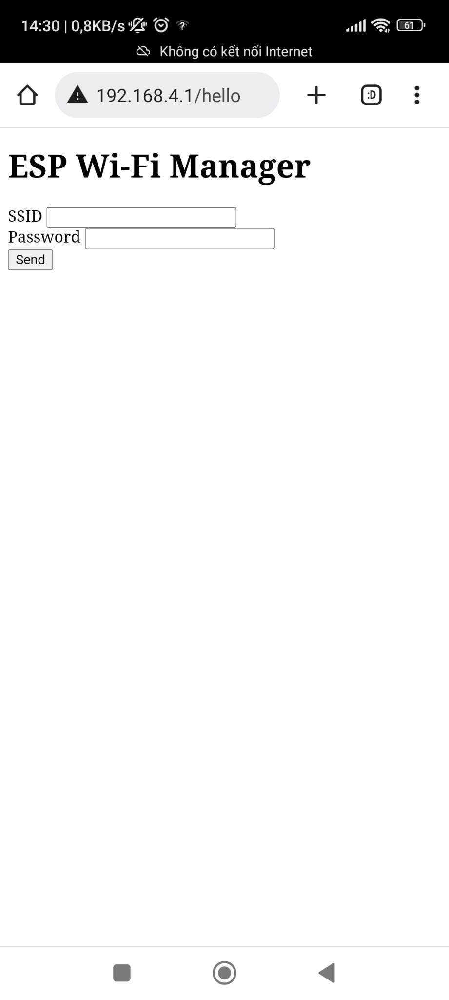

SSID:SSID of Router   
Password:Mật khẩu of Router 

=>Sau khi kết nối thành công ESP-32 sẽ lưu lại SSID và Password cho lần đăng nhập sau. 


#### Điều khiển Local
Nếu ESP-32 mất mạng nó sẽ tự động chạy chế độ điều khiển Local.Thiết bị đầu tiên kết nối sẽ có IP: 192.168.4.2.Người dùng gửi request đến AP bằng cách truy cập [192.168.4.1/local](192.168.4.1/local).Sự truyền nhận dữ liệu giữa gateway và device dựa trên giao thức TCP/IP với Gateway có IP:192.168.4.1(___ESP-32 Gateway___)
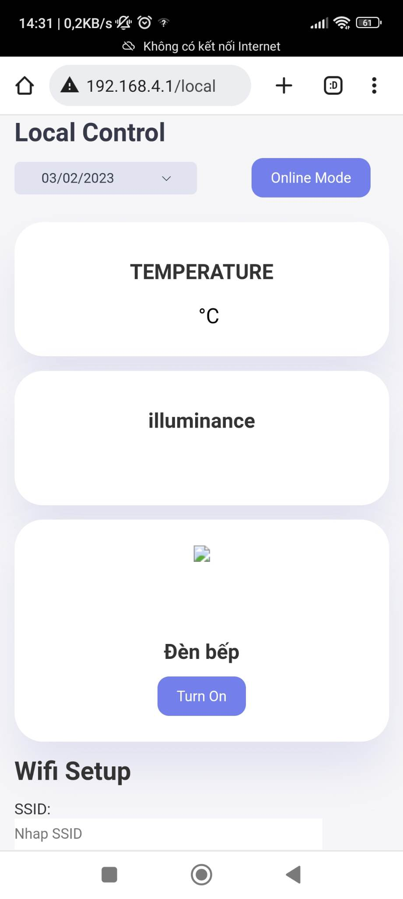

##### Các tính năng của web Local
1. Bật tắt Led device
2. Thay đổi mật khẩu wifi cho cả gateway và Device
3. Chuyển trạng thái từ Local sang Online Mode
---

#### Điều khiển Local
Khi Gateway nhận được dữ liệu từ Device nó sẽ Publish và Browser Subcriber và nhận được dữ liệu và Render ra đồ thị nhiệt độ.Dữ liệu được hiển thị trên Dashboard gồm: ___Nhiệt độ___, ___Cường độ ánh sáng___.
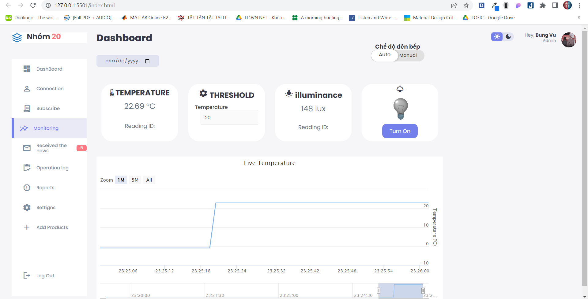

##### Các tính năng của Dashboard
1. Bật tắt Led device
2. Giám sát nhiệt độ và ánh sáng
3. Đặt ngưỡng cảnh báo nhiệt độ cho phép, nếu quá ngưỡng cho phép sẽ gửi gmail cảnh báo đến người dùng.
4. Đặt chế độ tự động bật tắt đèn dựa vào cường độ ánh sáng
5. Phát hiện gateway chưa kết nối mạng trên giao diện, bằng cách phủ màu đỏ toàn giao diện. 

###### Cảnh báo mất kết nối với gateway.

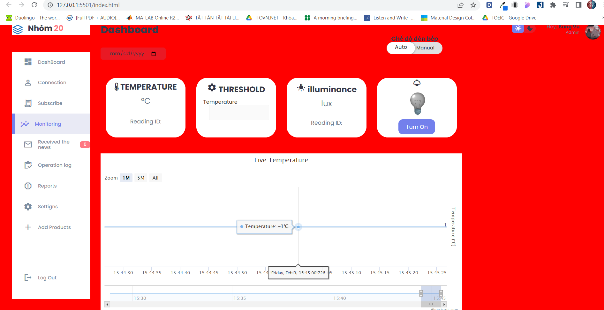

###### Cảnh báo trên giao diện. 

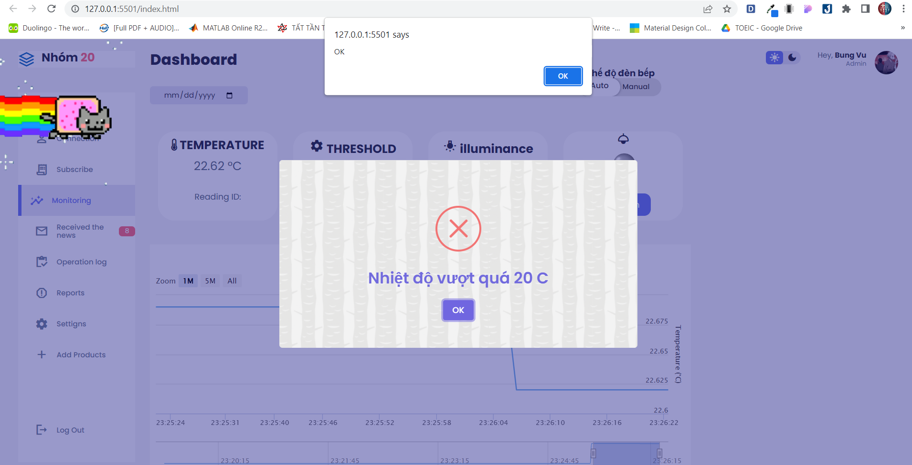

###### Cảnh báo trên gmail. 

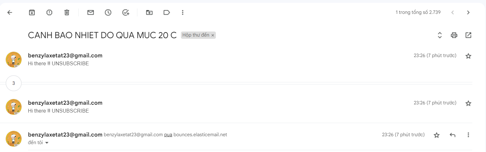

---

# Hướng dẫn sử dụng code

##### Khởi tạo các task 
- Khởi tạo và cấp phát bộ nhớ cho các task
- Thực hiện các chức năng Subcriber và Publishser nếu được cấu hình trong menuconfig
- Địa chỉ Host của broker sẽ là [mqtt://IPAddress:8000](mqtt://IPAddress:8000) 

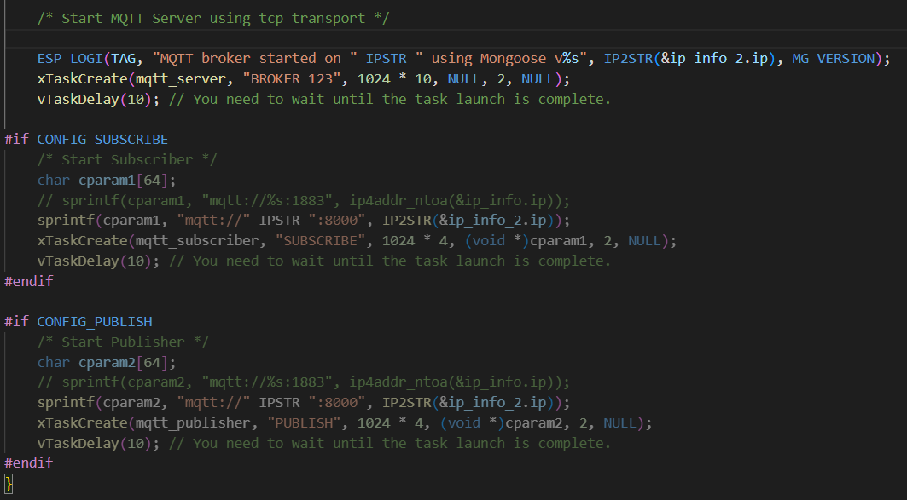

---

##### Broker 
- Khởi tạo và đăng kí callback cho function fn_broker
- Các sự kiện match được sẽ được sử lý trong function fn_broker

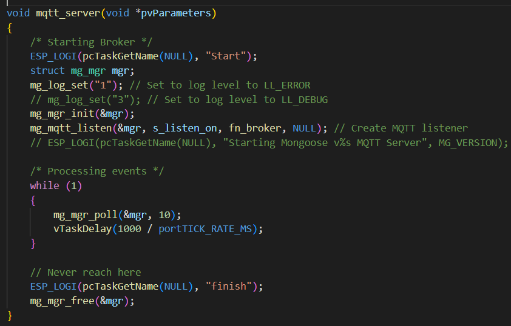

---

##### Xử lý sự kiện Broker 
- Bất cứ thiết bị nào connect với broker hay bản tin nào được publish đến Broker sẽ được match và xử lý


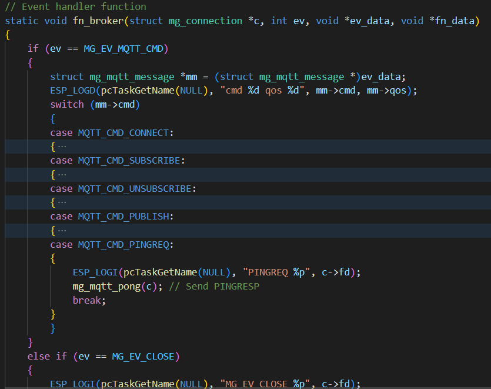

---

##### Task Subcriber 
- Khởi tạo bộ quản lý event trong monggoose
- Kết nối đến địa chỉ host broker
- Đăng ký callback cho function fn
- Task sẽ bị ___BLOCKED___ cho đến khi kết nối được với Host. 

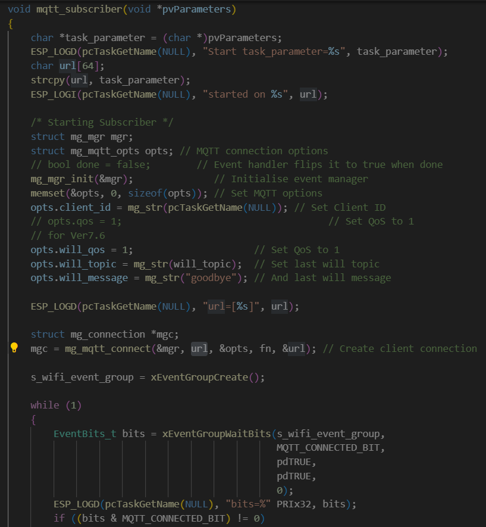

---

##### Xử lý sự kiện Subcriber
- Function callback được gọi khi có Event từ broker
- Set EventBit để đồng bộ với Task Subcriber
- Nhận Payload từ device và gửi cho Browser 

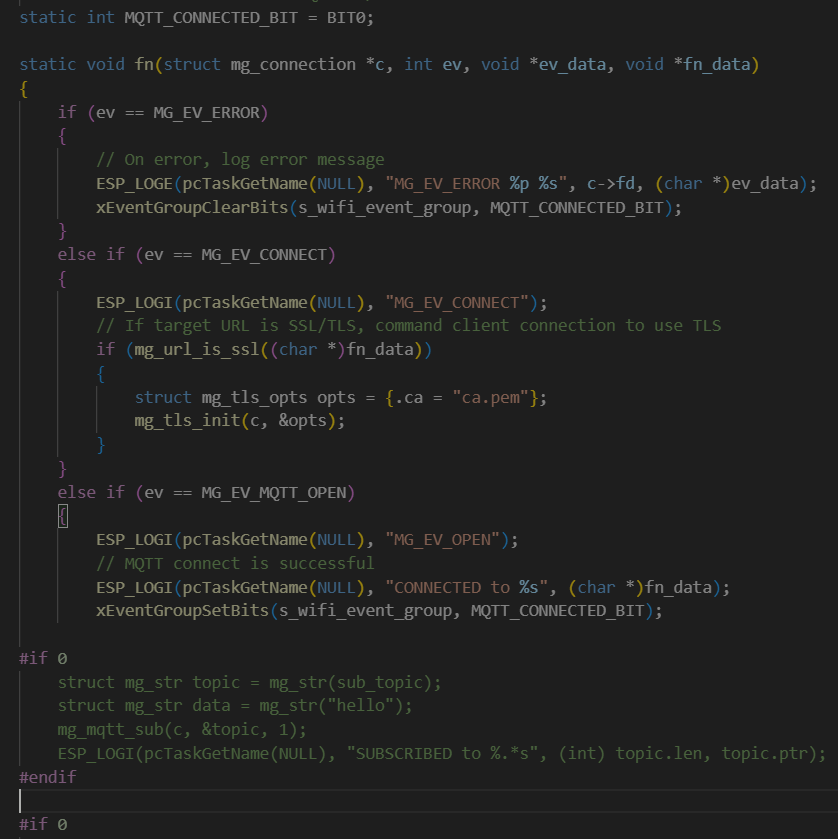

---

##### Task Publisher
- Khởi tạo bộ quản lý event trong monggoose
- Kết nối đến địa chỉ host broker
- Đăng ký callback cho function fn
- Task sẽ bị ___BLOCKED___ cho đến khi nhận được message từ Browser

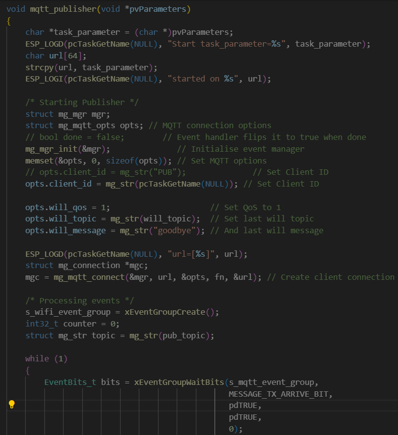

---

##### Lưu lại thông tin về wifi
- Khởi tạo NVS_Handle trong SPIFFS quyền đọc và ghi file
- Lưu thông tin wifi vào SPIFFS dựa vào nvs_key vaf nvs_handler
- Lấy thông tin từ SPIFFS để đăng nhập
- Xác nhận bằng hàm nvs_commit để hoàn thành việc lưu. 

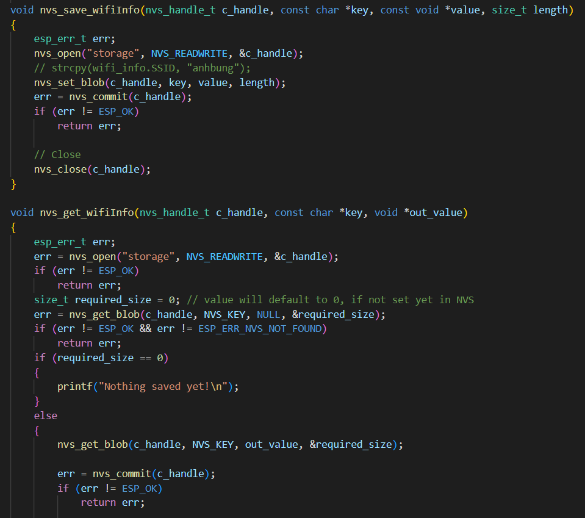

---

##### Lưu lại thông tin về wifi
- Khởi tạo NVS_Handle trong SPIFFS quyền đọc và ghi file
- Lưu thông tin wifi vào SPIFFS dựa vào nvs_key vaf nvs_handler
- Lấy thông tin từ SPIFFS để đăng nhập
- Xác nhận bằng hàm nvs_commit để hoàn thành việc lưu. 


---

##### Local Server
- Khởi tạo http server
- Đăng ký các hàm handler
- Xử lý mỗi khi có thiết bị Request đến Server

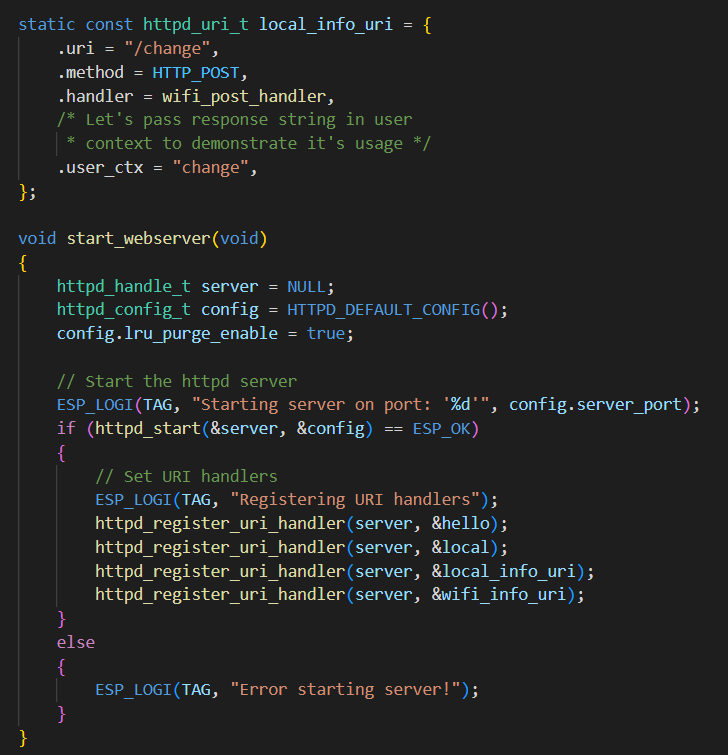


---

##### TCP Server 
- Khởi tạo domain cho TCP Server
- Đợi EventBit để đồng bộ task Local control
- Tạo 1 Socket Stream để Device có thể kết nối đến
- Lắng nghe và chấp thuận yêu cầu kết nối từ phía Device

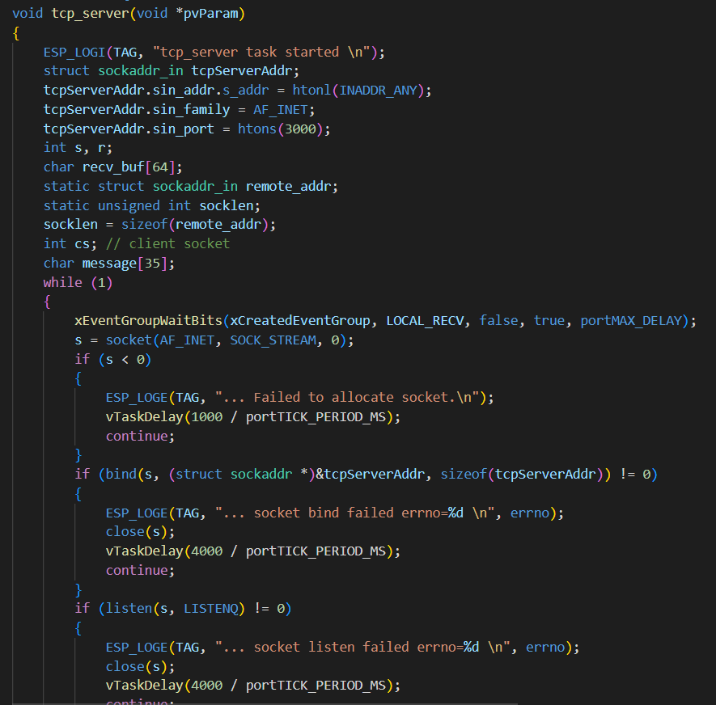